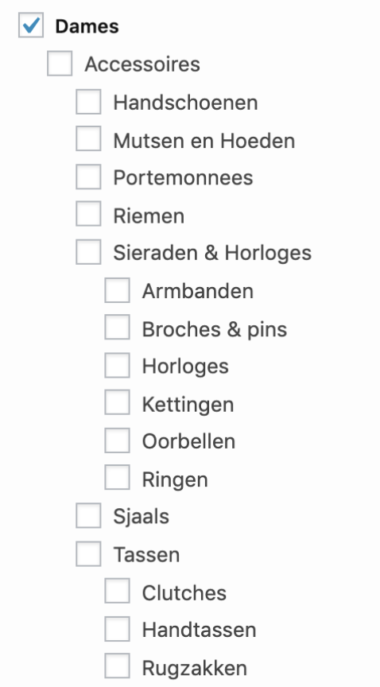

## Otrium Frontend Engineer Challenge: Faceted Checkbox Tree

## Get started:

Welcome to Juan Calero's Otrium challenge!

In order to start the project, please run this on the command line:

```
yarn && yarn start
```

You can see the unit tests in action by running this command:

```
yarn jest
```

## Code Structure:

A little sneak peak of what you'll find inside "src/":

- "/api" - where the "response.json" file lives
- "/contexts" - where the react contexts are kept, along with their easy-to-use wrappers
- "/design-system" - our most bite-sized and reusable components are here (buttons, checkboxes, tokens, ...)
- "/sections" - the big sections of our code, concerning layout and page business logic
- "/types" - reusable Types that are used throughout the app

## Demo:

https://github.com/Juan-calero/faceted-checkbox-tree/assets/81999819/78fc48a9-6cd9-4288-a6b5-6c573ffec74b

## Bonus:

- Added a cross button on each chosen category to easily deselect options.

## Challenge Requirements:


#### Introduction:

Welcome to the Otrium challenge!
Facets are an essential part of filtering that make it easier for users to narrow down their choices quickly.
In this exercise, you will create a faceted checkbox tree component using React.

#### Task:

Given a server response, your goal is to create a user-friendly UI that displays a tree of checkboxes with names for the categories, similar to the provided preview.png.



#### Instructions:

1. **Category Tree UI:** ✅

   Build a UI checkbox tree representing the category hierarchy provided by the response.json data.
   The root category is `gender`, marked by the attribute `parent: "0"`.
   You can use the provided `response.json` data directly or wrap it with a Promise for use in your solution.

2. **Hierarchy Display:** ✅

   Initially, only parent categories should be displayed.
   Implement the ability for users to expand the tree by clicking on a category name. For example, clicking "Kleding" should show all of its children, and so on.

3. **Category Selection:** ✅

   Enable category selection by clicking on a checkbox.
   Clicking a checkbox should:

   - Select the category if it's not already selected.
   - Deselect the category if it's already selected.

4. **Subcategory Selection:** ✅

   When a parent category is clicked, it should:

   - Be marked as selected (or deselected) based on its current state.
   - Select (or deselect) all of its children accordingly.

   Clicking an already selected parent category should:

   - Deselect the parent category.
   - Deselect all its children.

5. **Implement a "Select All" button for user convenience.** ✅
   When clicked:

   - If all categories are unselected, select all categories.
   - If all categories are selected, deselect all categories.

6. **Display Selected Categories:** ✅
   Display a list of selected categories to provide user feedback.

#### Requirements and Bonuses:

1. **Code Structure and Documentation:** ✅
   - Organize your work with a clear code structure.
   - Include a README with instructions on how to run and test your solution.
2. **Use of React:** ✅ You must use React for this challenge. However, you can choose additional frameworks and libraries if you wish (e.g., Next.js, Redux, Emotion, etc.).
3. **No Component Libraries:** ✅ Do not use any third-party component libraries. Build all components from scratch.
4. **Bonus Opportunities:**
   - Bonus points for creating a clean, concise interface with reusable components. ✅
   - Bonus points for implementing testing for your solution. ✅

#### Support and Questions:

Please feel free to reach out if anything is unclear or if you have any questions while completing the challenge.

###### Note:

You are encouraged to provide screenshots or additional supporting documentation to showcase your work.

Best of luck, and enjoy the challenge!
